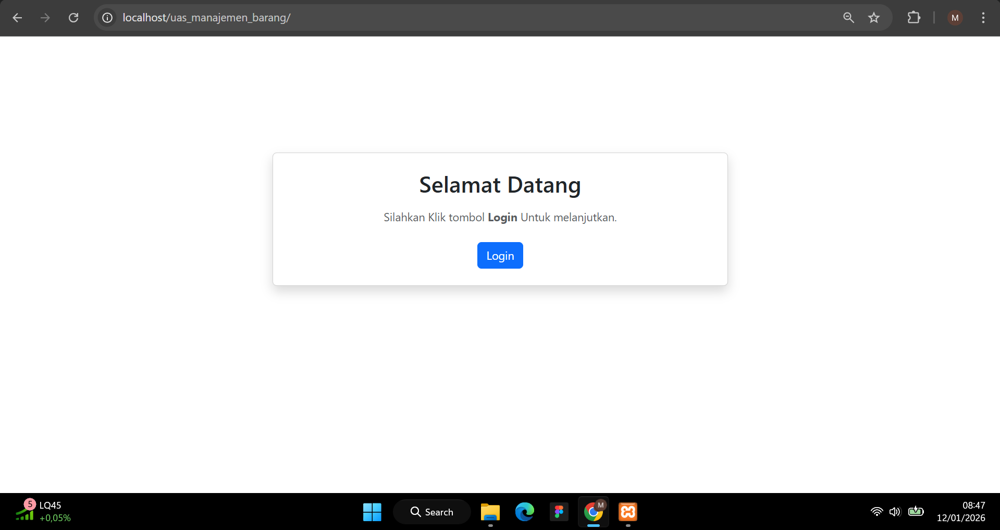
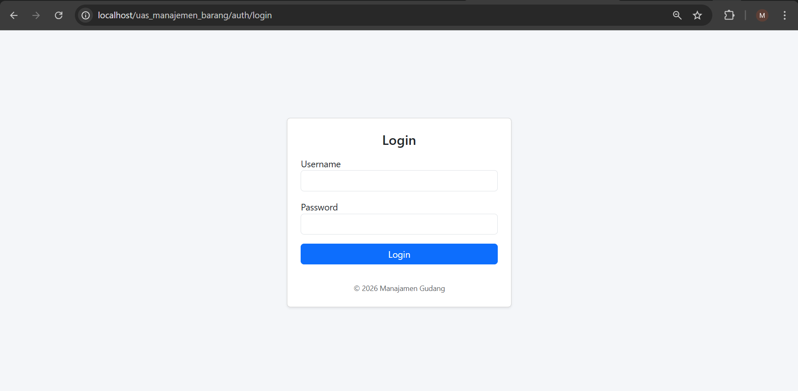
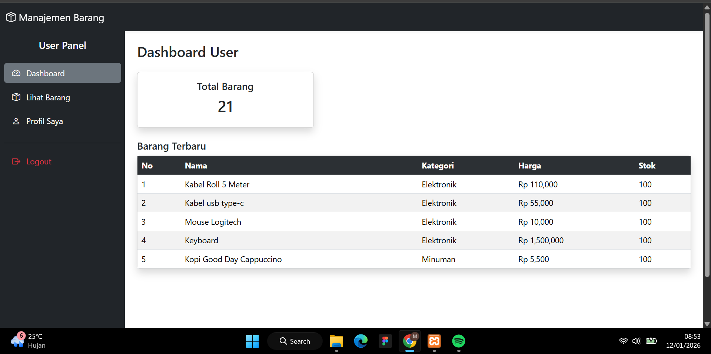
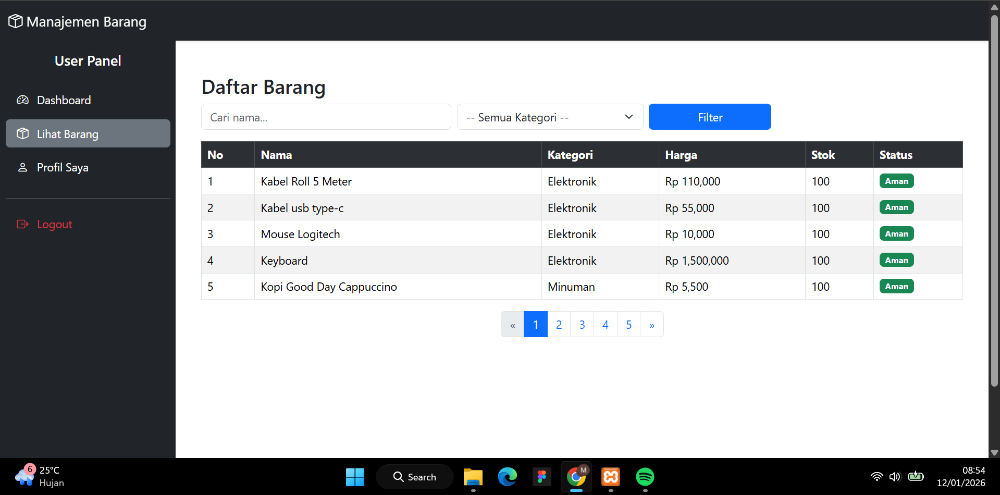
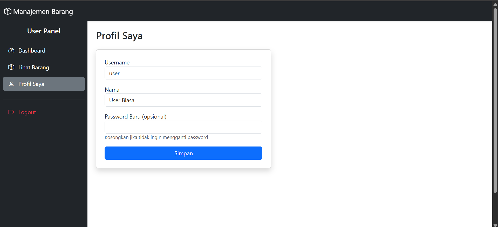
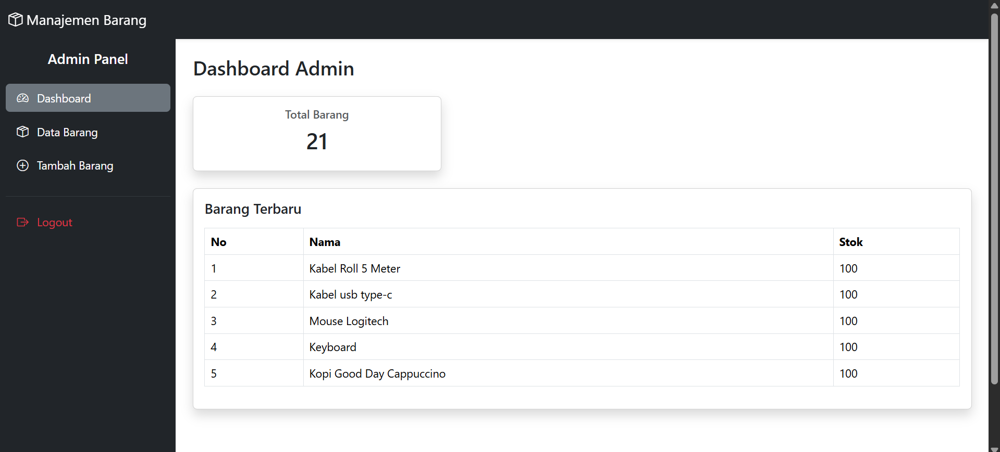
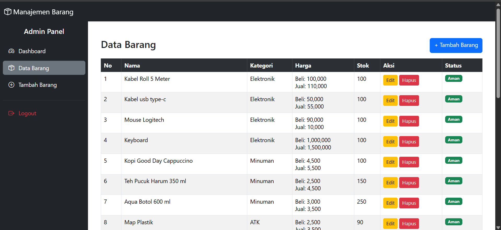
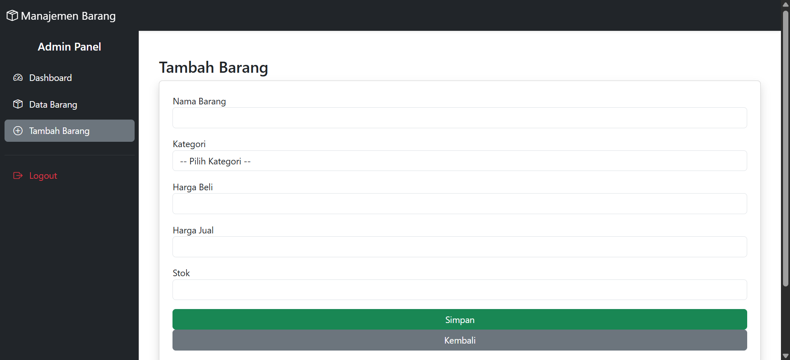
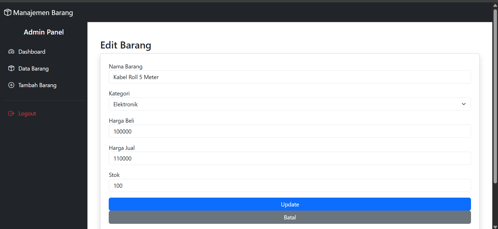

# APLIKASI MANAHEMEN GUDANG 
## Deskripsi Aplikasi 

Aplikasi Manajemen Barang adalah aplikasi berbasis web yang dibuat menggunakan PHP Native dengan pendekatan Object Oriented Programming (OOP) dan Modular Programming, serta menerapkan Routing App menggunakan .htaccess. Aplikasi ini bertujuan untuk membantu pengelolaan data barang seperti pencatatan, pengelompokan kategori, pencarian, serta pengaturan stok barang dengan sistem login berbasis role (admin & user). Aplikasi dikembangkan sebagai pemenuhan tugas praktikum mata kuliah Pemrograman Web / OOP & Modular.

## Tujuan Pembuatan 

- Menerapkan konsep OOP dalam PHP
- Menerapkan struktur modular
- Mengimplementasikan routing tanpa framework
- Membuat sistem login multi-role
- Membuat tampilan responsive (mobile-first)
- Mengimplementasikan CRUD, Filter Pencarian, dan Pagination

## Konsep yang Digunakan 

- Konsep & Teknologi yang Digunakan
- PHP Native
- Object Oriented Programming (OOP)
- Modular Programming
- Routing menggunakan .htaccess
- MySQL (mysqli)
- Bootstrap 5 (Responsive Design)
- Session Authentication

## Struktur Folder Aplikasi 
```

│   .htaccess
│   config.php
│   index.php
│
├───class
│       auth.php
│       barang.php
│       database.php
│
├───modules
│   ├───admin
│   │       barang_add.php
│   │       barang_delete.php
│   │       barang_edit.php
│   │       barang_list.php
│   │       dashboard.php
│   │
│   ├───auth
│   │       login.php
│   │       logout.php
│   │
│   ├───home
│   │       index.php
│   │
│   └───user
│           barang_list.php
│           dashboard.php
│           profile.php
│
└───template
        assets.php
        footer.php
        header.php
        sidebar_admin.php
        sidebar_user.php
```

## Alur Program 

1.** User mengakses aplikasi melalui browser**
   Pengguna membuka URL aplikasi, baik halaman utama, login dashboard, maupun fitur lainnya
   
2. **Request diterima oleh index.php**        
   File index.php berfungsi sebagai controller yang menangani seluruh request aplikasi
   
3. **Routing diproses menggunakan .htaccess**
   URL yang diakses diterjemahkan menjadi parameter path agar menentukan module dan halaman yang akan dipanggil tanpa menampilkan file .php

4. **Penentuan module dan halaman**
   index.php memecah URL menjadi:
   - nama module
   - nama halaman
   - parameter tambahan (jika ada)

5. **Pengecekan file module**
   Sistem mengecek apakah file module yang dituju tersedia di folder modules.
   
6. **Load asset dan template**
   - assets.php dipanggil untuk memuat CSS & JavaScript
   - header.php dan footer.php dimuat (kecuali halaman tertentu seperti login)
   
7. **Pemrosesan data oleh class**
   - Database.php → koneksi dan query database
   - Auth.php → autentikasi, session, dan role user
   - Barang.php → CRUD, pencarian, dan pagination data barang
8. **Validasi login dan role user**
   Sistem memastikan user sudah login dan memiliki role yang sesuai (admin atau user).
   
9. **Tampilan halaman dirender**
    Sistem memastikan user sudah login dan memiliki role yang sesuai (admin atau user).
    
10. **Halaman ditampilkan ke user**
    User melihat hasil akhir halaman yang sudah responsif dan sesuai hak akses.

## Tampilan Utama

| Home | Login |
|-------|-----------------|
|  |  |


## Tampilan User

| Dashboard User | List Barang, Filter dan Pagination |
|-------------|---------------------|
|  |  |

| Dashboard User |
|-------------|
|  | 


## Tampilan Admin 

| Home | List Admin |
|-------|-----------------|
|  |  |

| Tambah/Create | Edit dan Hapus |
|-------------|---------------------|
|  |  |


    

## Ringkasan 
### Index.php 

File index.php berfungsi sebagai router utama dalam aplikasi. File ini bertugas untuk menerima permintaan dari pengguna melalui parameter URL, kemudian menentukan modul dan halaman mana yang akan ditampilkan. Selain itu, index.php juga bertanggung jawab untuk memanggil konfigurasi aplikasi, class yang dibutuhkan, serta membungkus setiap halaman dengan template header dan footer. Dengan adanya router ini, struktur aplikasi menjadi lebih terorganisir dan mudah dikembangkan.

### Halaman Home

Halaman home merupakan halaman awal yang ditampilkan sebelum pengguna melakukan login. Pada halaman ini, pengguna akan melihat informasi singkat mengenai aplikasi serta tombol login. Sistem akan melakukan pengecekan session untuk menentukan apakah pengguna sudah login atau belum. Jika pengguna belum login, maka sistem akan menampilkan tombol login, sedangkan jika pengguna sudah login, maka akan ditampilkan tombol untuk masuk ke dashboard sesuai dengan role pengguna.

### Halaman Login 

Halaman login digunakan untuk melakukan proses autentikasi pengguna. Pada halaman ini, pengguna diminta untuk memasukkan username dan password. Data tersebut akan diverifikasi dengan database menggunakan class autentikasi. Jika data yang dimasukkan benar, sistem akan menyimpan informasi pengguna ke dalam session dan mengarahkan pengguna ke dashboard sesuai dengan role-nya. Password pada aplikasi ini disimpan dalam bentuk hash untuk meningkatkan keamanan.

### Dashboard Admin 

Dashboard admin merupakan halaman utama yang hanya dapat diakses oleh pengguna dengan role admin. Pada halaman ini, admin dapat melihat ringkasan data barang seperti jumlah total barang dan daftar barang terbaru. Dashboard ini juga menjadi pusat navigasi bagi admin untuk mengakses fitur manajemen barang, termasuk menambah, mengubah, dan menghapus data barang.

### Manajemen Data Barang 

Fitur manajemen barang hanya tersedia untuk admin dan mencakup seluruh proses CRUD (Create, Read, Update, Delete). Admin dapat menambahkan data barang baru, mengedit data barang yang sudah ada, serta menghapus data barang dari sistem. Selain itu, aplikasi juga menyediakan fitur filter pencarian berdasarkan kategori serta pagination untuk mempermudah pengelolaan data dalam jumlah besar. Seluruh proses pengolahan data barang ini diatur melalui class Barang sehingga logika aplikasi terpusat dan rapi.

## Dashboard User

Dashboard user merupakan halaman utama bagi pengguna dengan role user. Pada halaman ini, user dapat melihat informasi barang dalam bentuk ringkasan dan daftar barang terbaru. Berbeda dengan admin, user tidak memiliki akses untuk mengubah atau menghapus data barang. Dashboard ini bersifat informatif dan hanya memberikan akses baca (read-only) kepada user.

## Template Tampilan 

Folder template digunakan untuk menyimpan komponen tampilan yang digunakan secara berulang di berbagai halaman. Komponen tersebut meliputi header, footer, dan pemanggilan asset seperti CSS dan JavaScript. Dengan menggunakan template, tampilan aplikasi menjadi konsisten dan perubahan desain dapat dilakukan dengan lebih mudah tanpa harus mengubah setiap halaman satu per satu.

## Class dan Logika Aplikasi 

Folder class berisi kumpulan class yang menangani logika utama aplikasi. Class Database digunakan untuk mengatur koneksi dan query ke database, class Auth menangani proses autentikasi pengguna, dan class Barang bertanggung jawab atas pengolahan data barang. Pemisahan logika ini bertujuan agar kode lebih terstruktur, mudah dipahami, dan sesuai dengan prinsip OOP.


